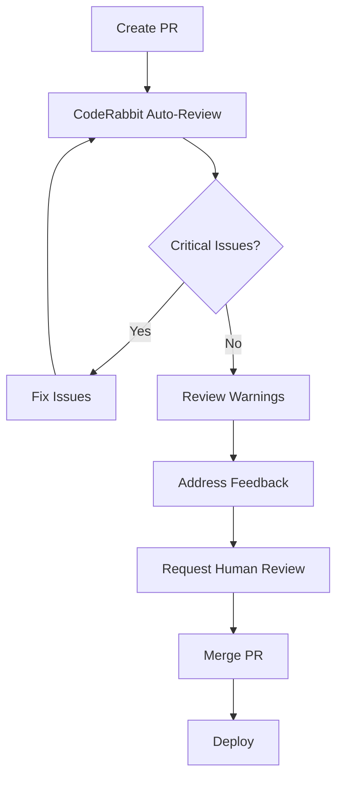

# CodeRabbit Pre-Deploy Check Documentation

## Overview

DeanOS (Hyperion AI) uses CodeRabbit for AI-powered code review and quality checks before deployment. This system ensures that all code changes meet quality standards and are safe to deploy.

## What is CodeRabbit?

CodeRabbit is an AI-powered code review tool that provides:
- **Automated Code Review**: Intelligent analysis of pull requests
- **Security Scanning**: Detection of potential security vulnerabilities
- **Best Practices**: Enforcement of coding standards and patterns
- **Performance Analysis**: Identification of performance issues
- **Documentation Checks**: Verification of code documentation

## Configuration

### Main Configuration File

The `.coderabbit.yaml` file in the repository root contains all CodeRabbit settings:

```yaml
language: en-US
reviews:
  auto_review:
    enabled: true
quality:
  security:
    enabled: true
  performance:
    enabled: true
  maintainability:
    enabled: true
```

### Key Features Enabled

#### Security Checks
- ✅ Vulnerability detection
- ✅ Secret scanning in code
- ✅ Security best practices validation
- ✅ Dependency security analysis

#### Code Quality
- ✅ Code complexity analysis
- ✅ Duplication detection
- ✅ Code smell identification
- ✅ Performance anti-pattern detection

#### Documentation
- ✅ Function documentation requirements
- ✅ Class documentation checks
- ✅ README update validation
- ✅ Inline comment requirements for complex logic

#### Language-Specific Rules
- ✅ JavaScript/TypeScript pattern checking
- ✅ Async/await error handling validation
- ✅ Modern JavaScript pattern enforcement
- ✅ Type safety verification (TypeScript)

## Pre-Deploy Workflow

### Automatic Triggers

The pre-deploy workflow runs automatically on:
1. **Pull Requests**: When opened, updated, or marked ready for review
2. **Push to main/master**: Direct commits to main branches
3. **Manual Trigger**: Via GitHub Actions workflow dispatch

### Workflow Steps

```
1. Configuration Validation
   ↓
2. Pre-Deploy Quality Checks
   ↓
3. Lint Checks (if npm scripts available)
   ↓
4. Report Generation
   ↓
5. PR Comment (if applicable)
```

### Quality Checks Performed

#### Critical Checks (Must Pass)
- ❌ No debugger statements in code
- ❌ No hardcoded credentials
- ❌ No security vulnerabilities

#### Warning Checks (Review Recommended)
- ⚠️ Console.log statements in production code
- ⚠️ TODO/FIXME comments
- ⚠️ Missing error handling in async functions
- ⚠️ Large files (>500KB)

## Using CodeRabbit

### For Pull Requests

1. **Create a Pull Request**: Open a PR targeting `main` or `master`
2. **Automatic Review**: CodeRabbit will automatically analyze your changes
3. **Review Comments**: AI-generated comments will appear on your PR
4. **Address Issues**: Fix any critical issues or respond to suggestions
5. **Re-review**: CodeRabbit will re-analyze after updates

### For Direct Commits

1. **Push Changes**: Commit and push to main/master
2. **Automatic Check**: Pre-deploy workflow runs automatically
3. **Review Status**: Check the Actions tab for results
4. **Fix Issues**: Address any failures found

### Manual Trigger

1. Navigate to **Actions** tab in GitHub
2. Select **Pre-Deploy CodeRabbit Check** workflow
3. Click **Run workflow**
4. Select branch and click **Run workflow** button

## Understanding CodeRabbit Feedback

### Feedback Severity Levels

#### 🔴 Error (Critical)
- **Action Required**: Must be fixed before deployment
- **Examples**: Security vulnerabilities, breaking changes, debugger statements
- **Impact**: Blocks deployment

#### 🟡 Warning (Important)
- **Action Recommended**: Should be reviewed and addressed
- **Examples**: Console.log statements, missing documentation, code smells
- **Impact**: Deployment allowed but review recommended

#### 🔵 Info (Suggestion)
- **Action Optional**: Nice-to-have improvements
- **Examples**: Style improvements, alternative patterns
- **Impact**: No deployment impact

### Sample CodeRabbit Comment

```markdown
## 🤖 CodeRabbit Review

### Security
- ⚠️ Potential XSS vulnerability on line 42
  Recommendation: Sanitize user input before rendering

### Performance
- 💡 Consider using useMemo for expensive calculation on line 108
  This will improve component render performance

### Best Practices
- ✅ Good error handling implementation
- ✅ Proper TypeScript types used
```

## Custom Rules for DeanOS

### Async Error Handling
All async functions must include try-catch blocks:
```javascript
// ✗ Bad
async function fetchData() {
  const data = await api.get('/data');
  return data;
}

// ✓ Good
async function fetchData() {
  try {
    const data = await api.get('/data');
    return data;
  } catch (error) {
    console.error('Failed to fetch data:', error);
    throw error;
  }
}
```

### No Console Logs in Production
Remove console.log statements before deployment:
```javascript
// ✗ Bad - Will trigger warning
console.log('Debug info:', data);

// ✓ Good - Use proper logging
logger.debug('Debug info:', data);
```

### Hyperion AI Branding
Maintain consistent branding:
```javascript
// ✓ Correct
const title = "Hyperion AI";

// ✗ Incorrect
const title = "Hyperion";
```

## Configuration Customization

### Adjusting Review Strictness

Edit `.coderabbit.yaml` to change review level:

```yaml
reviews:
  level: comprehensive  # Options: basic, standard, comprehensive
```

### Excluding Files/Directories

Add patterns to exclude paths:

```yaml
paths:
  exclude:
    - "vendor/**"
    - "generated/**"
    - "*.min.js"
```

### Adding Custom Rules

Add project-specific rules:

```yaml
custom_rules:
  - name: rule_name
    pattern: "regex_pattern"
    message: "Description of the issue"
    severity: error  # or warning, info
```

### Mandatory Pre-Deploy Checks

Customize what blocks deployment:

```yaml
pre_deploy:
  mandatory_checks:
    - no_security_vulnerabilities
    - no_breaking_changes
    - tests_passing
    - no_console_logs_in_production
```

## Troubleshooting

### CodeRabbit Not Commenting

**Issue**: CodeRabbit doesn't add review comments to PR

**Solutions**:
1. Verify `.coderabbit.yaml` exists and is valid
2. Check that the GitHub App has necessary permissions
3. Ensure PR targets `main` or `master` branch
4. Check GitHub Actions logs for errors

### Workflow Failing

**Issue**: Pre-deploy workflow shows failure status

**Solutions**:
1. Check workflow logs in Actions tab
2. Look for specific error messages
3. Verify all files pass quality checks
4. Fix any critical issues (debugger, credentials, etc.)

### False Positives

**Issue**: CodeRabbit flags valid code as problematic

**Solutions**:
1. Add inline comments explaining why code is correct
2. Add file/pattern to exclude list in `.coderabbit.yaml`
3. Adjust rule severity or disable specific rules
4. Provide feedback to improve AI learning

### Too Many Warnings

**Issue**: Too many warnings make review difficult

**Solutions**:
1. Adjust warning thresholds in configuration
2. Focus on critical issues first
3. Create separate PR for cleanup items
4. Update configuration to match project standards

## Best Practices

### Before Creating a PR

1. ✅ Run local linting: `npm run lint`
2. ✅ Remove console.log statements
3. ✅ Remove debugger statements
4. ✅ Add/update documentation
5. ✅ Write tests for new features
6. ✅ Review your own changes first

### During Code Review

1. ✅ Read all CodeRabbit comments
2. ✅ Address critical issues immediately
3. ✅ Consider all suggestions thoughtfully
4. ✅ Ask questions if feedback is unclear
5. ✅ Update based on feedback
6. ✅ Re-run checks after changes

### After Review

1. ✅ Verify all checks pass
2. ✅ Ensure PR is approved
3. ✅ Check that deployment is safe
4. ✅ Monitor post-deployment
5. ✅ Update documentation if needed

## Integration with Other Tools

### CodeQL Integration
CodeRabbit works alongside CodeQL for security:
- CodeQL: Deep security analysis
- CodeRabbit: AI-powered code review
- Both run automatically on PRs

### Health Check Integration
Works with existing health check system:
```bash
# Both can be run together
./health_check.sh          # System health
# CodeRabbit checks via PR  # Code quality
```

### Deno Integration
Compatible with Deno workflow:
- Deno lint runs first
- CodeRabbit provides additional review
- Both must pass for merge

## Monitoring and Metrics

### Viewing Check Results

1. **Actions Tab**: See workflow execution
2. **PR Comments**: View AI-generated feedback
3. **Status Checks**: See pass/fail status
4. **Logs**: Detailed check information

### Success Metrics

Track these indicators:
- ✅ Percentage of PRs passing first review
- ✅ Average time to address feedback
- ✅ Number of critical issues caught
- ✅ Reduction in post-deploy issues

## Maintenance

### Regular Updates

1. **Monthly**: Review and update rules
2. **Quarterly**: Adjust thresholds based on metrics
3. **As Needed**: Add rules for new patterns
4. **Continuous**: Monitor feedback quality

### Configuration Review

Periodically review:
- Are rules too strict or too lenient?
- Are there false positives to address?
- Do custom rules match current needs?
- Is AI learning from feedback?

## Getting Help

### Resources

- **Configuration**: `.coderabbit.yaml`
- **Workflow**: `.github/workflows/pre-deploy-coderabbit.yml`
- **This Guide**: `docs/CODERABBIT.md`
- **Health Check**: `HEALTH_CHECK.md`

### Support

For issues or questions:
1. Check this documentation
2. Review workflow logs
3. Check CodeRabbit documentation
4. Open an issue in the repository

## Example Workflow

### Complete PR Process



### Timeline

1. **0 min**: PR created
2. **2-3 min**: CodeRabbit starts review
3. **5-10 min**: Initial feedback provided
4. **Variable**: Developer addresses issues
5. **2-3 min**: Re-review on updates
6. **Variable**: Human review
7. **Final**: Merge and deploy

## Conclusion

CodeRabbit pre-deploy checks ensure code quality and security for DeanOS (Hyperion AI). By following this documentation and best practices, you can maintain high-quality code and catch issues before they reach production.

For the latest updates and configuration changes, always refer to:
- `.coderabbit.yaml` - Current configuration
- `.github/workflows/pre-deploy-coderabbit.yml` - Workflow definition
- This documentation - Usage guidelines

---

*Part of the DeanOS (Hyperion AI) autonomous AI system*
*Last Updated: 2025-12-12*
